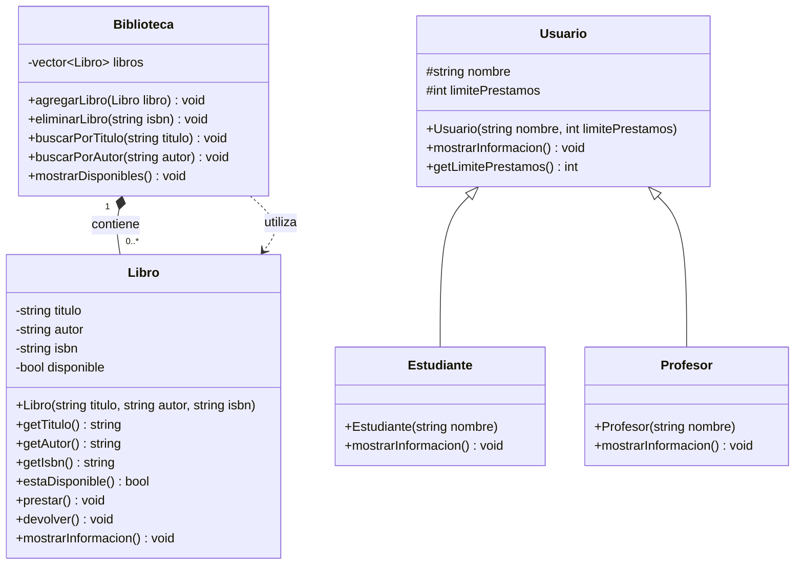

# Diagrama UML - Sistema de Biblioteca

```mermaid
classDiagram

class Libro {
    -string titulo
    -string autor
    -string isbn
    -bool disponible
    +Libro(string titulo, string autor, string isbn)
    +getTitulo() string
    +getAutor() string
    +getIsbn() string
    +estaDisponible() bool
    +prestar() void
    +devolver() void
    +mostrarInformacion() void
}

class Biblioteca {
    -vector~Libro~ libros
    +agregarLibro(Libro libro) void
    +eliminarLibro(string isbn) void
    +buscarPorTitulo(string titulo) void
    +buscarPorAutor(string autor) void
    +mostrarDisponibles() void
}

class Usuario {
    #string nombre
    #int limitePrestamos
    +Usuario(string nombre, int limitePrestamos)
    +mostrarInformacion() void
    +getLimitePrestamos() int
}

class Estudiante {
    +Estudiante(string nombre)
    +mostrarInformacion() void
}

class Profesor {
    +Profesor(string nombre)
    +mostrarInformacion() void
}

Biblioteca "1" *-- "0..*" Libro : contiene
Usuario <|-- Estudiante
Usuario <|-- Profesor
Biblioteca ..> Libro : utiliza
```
